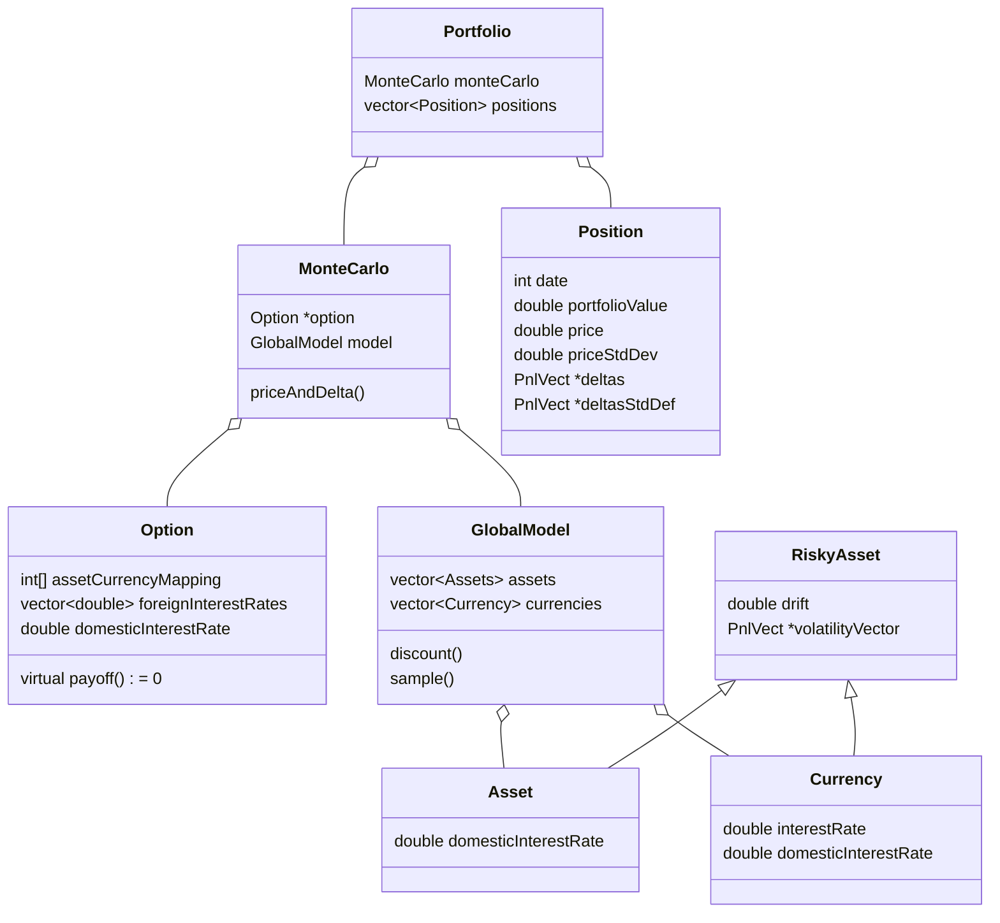

# Architecture

Suggestion d'architecture

```mermaid
classDiagram
MonteCarlo o-- Option
MonteCarlo o-- GlobalModel
MonteCarlo : Option *option
MonteCarlo : GlobalModel model
MonteCarlo : priceAndDelta()

Option : int[] assetCurrencyMapping
Option : vector~double~ foreignInterestRates
Option : double domesticInterestRate
Option : virtual payoff() = 0


GlobalModel o-- Asset
GlobalModel o-- Currency
GlobalModel : vector~Assets~ assets
GlobalModel : vector~Currency~ currencies
GlobalModel : discount()
GlobalModel : sample()

Asset : double domesticInterestRate
Currency : double interestRate
Currency : double domesticInterestRate

RiskyAsset <|-- Asset
RiskyAsset <|-- Currency
RiskyAsset : double drift
RiskyAsset : PnlVect *volatilityVector

Portfolio o-- Position
Portfolio o-- MonteCarlo
Portfolio : MonteCarlo monteCarlo
Portfolio : vector~Position~ positions

class Position {
  int date
  double portfolioValue
  double price
  double priceStdDev
  PnlVect *deltas
  PnlVect *deltasStdDef
}

```
