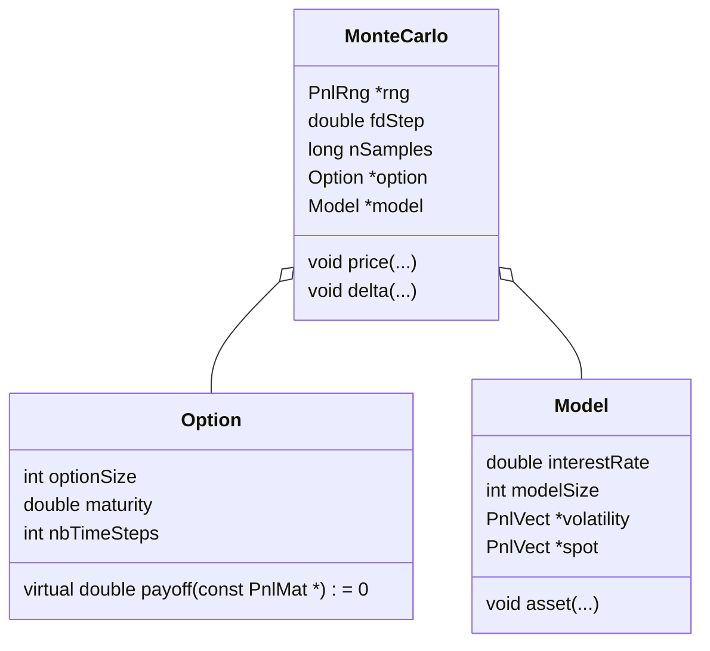

# Suggestion d'architecture

```mermaid
classDiagram
MonteCarlo o-- Option
MonteCarlo o-- Model
MonteCarlo : PnlRng *rng
MonteCarlo : double fdStep
MonteCarlo : long nSamples
MonteCarlo : Option *option
MonteCarlo : Model *model
MonteCarlo : void price(...)
MonteCarlo : void delta(...)


Option : int optionSize
Option : double maturity
Option : int nbTimeSteps
Option : virtual double payoff(const PnlMat *) = 0


Model : double interestRate
Model : int modelSize
Model : PnlVect *volatility
Model : PnlVect *spot
Model : void asset(...)
```
